# SimPitRadio

Push-to-talk voice dictation into sim racing chat boxes.

 

Hold a key, say what you want, let go. SimPitRadio opens the game's chat box,
transcribes what you said, types it, and sends it — without you taking a hand
off the wheel. Speech recognition runs locally on the CPU; nothing you say
leaves your machine.

Built for wheel-mounted buttons: bind one directly, or put F13 on the wheel
with your wheel's own software or JoyToKey, and SimPitRadio sees it as an ordinary
key.

It has grown two things beyond dictation, both off until you switch them on: a
**race engineer** that talks to you and answers questions, and a **coach** that
draws the segment you have just driven against a rival's line and says what to
change.

## Roadmap

**Where it is today.** Dictation works in any game that has a chat box you
open with a key. Beyond that, one sim is properly supported: Le Mans Ultimate,
which ships with a profile and is the only one the engineer and coach have
been developed and measured against. Session plugins exist for iRacing,
Assetto Corsa, Automobilista 2 and Project CARS, but none has been run against
its real game — they are written from each sim's published memory layout and
are marked experimental in the app for that reason. Any other sim works for
dictation by adding a profile, which takes about a minute: see
[Adding your sim](#adding-your-sim).

### Verified sim support

- **Automobilista 2** — the plugin is written and reads the shared memory
  block; what it has never had is a session in the actual game to check it
  against. Verifying it means confirming the driver list, the standings and
  the flags against what is on screen.
- **Assetto Corsa EVO** — covered by the Assetto Corsa plugin, which reads the
  same shared pages as Competizione. EVO moved some of them, so this needs the
  layout checked against a running copy rather than assumed.

Neither is a large job and both are mostly a matter of somebody sitting in the
car with the app open. The engineer needs more from a sim than dictation does
— where every car is, lap and sector times, flags, fuel, and for the coach the
across-track offset — and a plugin can support the first few and not the rest.
[Session plugins](#session-plugins) says what each flag means.

### Languages

The app speaks English. Everything it says is already routed through a
catalogue and extracted to `apps/client/src/pitradio/locale/template.json`, so a language
is a translated copy of that file dropped into the same folder — the app finds
it and offers it without a release. What is missing is the translations
themselves:

**German · French · Italian · Spanish · Portuguese · Polish · Korean ·
Japanese · Dutch**

Two things are worth knowing before starting one. Dictation is a separate
question — Whisper already transcribes all of these, and the Language tab
picks the model for it, so speaking to the app in your own language works
today. And the engineer's *voice* is a folder of recordings, so a translated
catalogue with no voice pack behind it falls through to the Windows
synthesiser for the phrases it has not got — see
[docs/voicepacks.md](docs/voicepacks.md).

### More sim profiles and plugins

So more games work without you adding anything. A profile is what lets
SimPitRadio type into a game's chat box; a plugin is what lets the engineer know
who is on track around you. The quickest way to get your sim on the list is
[an issue](#reporting-a-fault) saying what it is called.

Both of these are **paid services that run alongside what you already have**,
not replacements for it. The coach and the engineer described below keep doing
exactly what they do now; these sit beside them and add the thing a fixed set
of phrases cannot do, which is talk about what is happening *right now*, in
words chosen for it.

### AI Coaching

The coach you have looks at the segment you have just driven and tells you what
went wrong in it. It is honest and it is local, and it has no memory: every
corner is judged on its own.

The AI coach watches across corners, laps and sessions, and looks for the thing
you do *every time*. A driver who brakes fractionally too late into every
right-hander, or who unwinds the wheel a beat early on every exit, has one
habit rather than forty separate mistakes — and being told about it forty times
is not the same as being helped to fix it. It finds the pattern, tells you what
it is, and then works with you on it: what to change, whether the change is
taking, and when it has stuck.

It also drives. Given an offline practice session it will set a quick lap on
your own car and your own setup, so there is a reference to work towards even
when nobody faster is on track.

### AI Engineer

The engineer you have answers a fixed set of questions from what the sim
publishes — the fastest lap, who is ahead, how much fuel is left. Everything it
can be asked is known in advance, because everything it can *say* is a
recording.

The AI engineer reads the telemetry as the race happens and answers in its own
words: whether that stop works, what the weather is doing to your tyres, what
the car has been telling you for the last ten laps, whether to cover the stop
in front. Asked however you would ask a person, answered from what is actually
going on rather than from a list.

Both need a model too large to run on the machine also running the sim, so both
are GPU-backed and metered — you pay for the time you use. **Nothing else about
SimPitRadio changes.** Everything described below runs on your own machine, works
with no account and no connection, and always will.

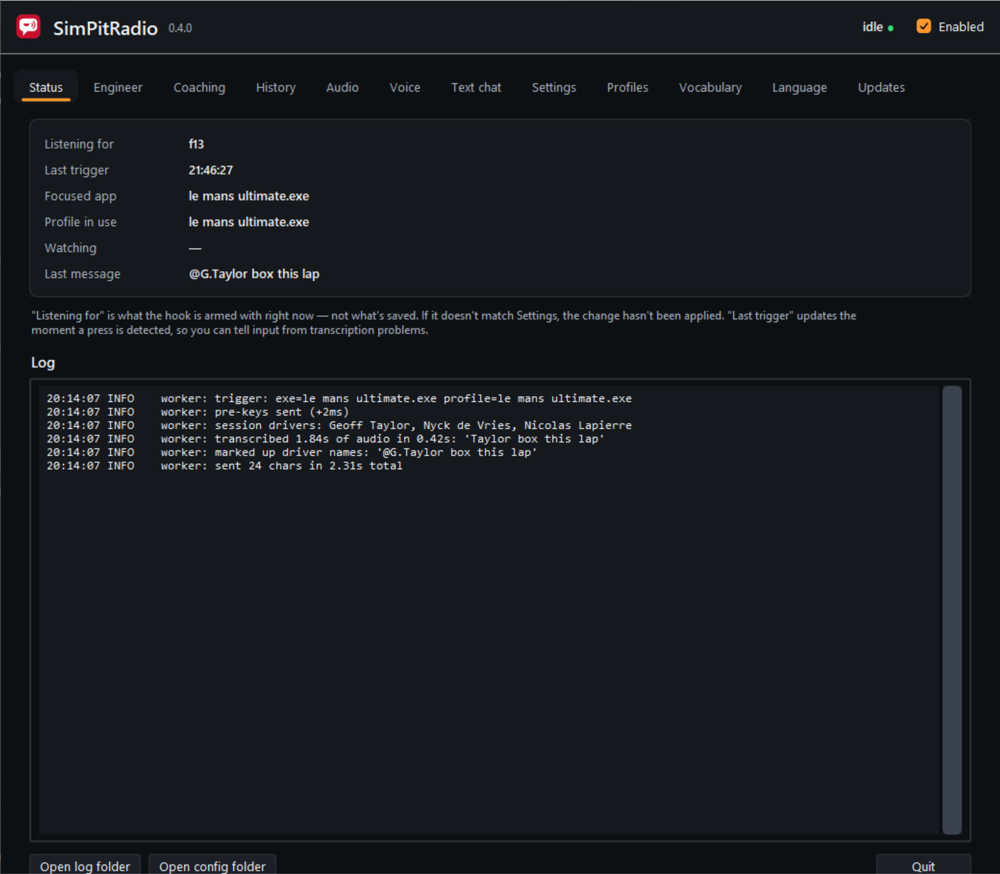

---

## Install

Download the latest `simpitradio-setup-*.exe` from
[Releases](https://github.com/kidunot89/simpitradio/releases) and run it.

**Windows will warn you about it.** Two separate things cause this, and both
are expected:

- **SmartScreen: "Windows protected your PC".** These builds aren't
  code-signed, so Windows has no publisher to attribute them to. Choose **More
  info → Run anyway**.
- **Antivirus may flag or quarantine it.** SimPitRadio installs a global keyboard
  hook and synthesises keystrokes. That is a keylogger's behavioural signature.
  It is also precisely what push-to-talk dictation requires — there is no way to
  swallow your trigger key and type into a game without it.

If you'd rather not take that on trust, every release publishes
[`SHA256SUMS`](https://github.com/kidunot89/simpitradio/releases) so you can check that
what you downloaded is what was built. Every release is also a portable `.zip`,
if you would rather not run an installer at all.

### It needs to run as administrator

The installed build requests this automatically. It matters because of a
Windows rule called UIPI: a normal-privilege process cannot send input to a
window owned by an elevated one. If your sim or its launcher runs elevated and
SimPitRadio doesn't, **every keystroke is silently discarded** — no error, no
exception, nothing typed. This is the single most common cause of "it does
nothing".

The Status tab warns you if the app isn't elevated.

---

## First run

1. Open SimPitRadio. On first launch it downloads the speech model (~250MB,
   once). The window shows the progress.
2. Go to **Audio**, pick your microphone, and press **Record 4s and
   transcribe**. Nothing is typed anywhere — this just proves the mic and the
   model work. If the level bar barely moves while you speak, raise
   **Microphone gain**; the bar shows the signal after gain, which is what
   Whisper actually receives.
3. Sort out a trigger key — see below.
4. Start your sim, hold the trigger, say something, release.

### About F13

The default trigger is **F13**, because no sim binds it — so holding it can
never also do something in the game while you are talking.

Almost no keyboard has an F13 key, and you do not need one. Put it on the
wheel: assign F13 to a button with **your wheel's own software**, or map one
with **[JoyToKey](https://joytokey.net/)**, and SimPitRadio sees an ordinary
keypress. That is the route to use if your wheel came with software you already
run, which most do.

SimPitRadio can also **bind a wheel button directly**, with nothing in between —
see below. Either way works; the direct route needs no third-party software,
and the F13 route works with any device at all, including one SimPitRadio cannot
open.

Whatever you pick, **Settings → Trigger** shows what is bound now, and you
don't have to type key names: **Press a key…** binds whatever you press next,
including combinations like `Ctrl+F12`, and the press is swallowed so binding
Enter doesn't also do something behind the window.

### Binding a wheel or gamepad button

**SimPitRadio reads wheels and gamepads directly.** Open **Settings → Trigger**,
click **Capture a wheel button**, and press the button you want to talk with.
It is bound, and it survives a restart.

The device is opened shared rather than seized, so the game keeps receiving the
button as well — you can bind one the sim already uses, though a spare one is
tidier. Presses arrive in about **4ms**.

**If the button does nothing:**

- **Press it during the fifteen seconds the capture is listening.** Buttons
  already held down when capture starts are ignored, so a rotary or a switch
  that rests in the "on" position has to be moved rather than found.
- **Check the Status tab.** Press the button; the **Last trigger** row stamps
  the time the moment a press is seen. If it updates, the binding works and the
  rest is just Settings.
- **Run as administrator.** The installed build self-elevates.

**Or wire the wheel to a keyboard key instead**, which is the other route from
[About F13](#about-f13) and the one to reach for if your wheel's own software
is already running, or if the device does not appear here at all: map the
button with **[JoyToKey](https://joytokey.net/)** and SimPitRadio sees an ordinary
keypress. It has always worked and still does.
- **Run both as administrator.** SimPitRadio's installed build self-elevates. If
  JoyToKey is not elevated, Windows will not let its synthetic keypresses reach
  an elevated SimPitRadio, and nothing happens with no error at all.
- **Does the key work from the keyboard?** Bind the trigger to something you
  can actually press, like `scrolllock`, and test that first. That separates a
  JoyToKey problem from a SimPitRadio one.

**Why not read the controller directly?** SimPitRadio used to, through four
backends — SDL3, SDL2, XInput and the Windows multimedia API. Between them they
still could not reliably read a Fanatec rim (79 inputs enumerated, no button
press ever reported) or a Steam Controller, because both are held by software
that will not share the device. The only way to see a Steam Controller at all
was to take it away from Steam, which breaks the owner's own shortcuts. A
dictation app has no business seizing your wheel. JoyToKey solves it at the
layer that actually owns the device, and the keyboard hook has always worked.

To try it at a desk with no wheel plugged in, `scrolllock` and `pause` are good
choices: present on most keyboards, rarely bound by sims.

Whatever you pick is **swallowed**: it never reaches the game, so don't use a
key the sim needs.

Closing the window minimises to the tray; the trigger key keeps working. Quit
from the tray menu to actually stop the app.

---

## Checking a message before it goes out

By default the message is sent as soon as it's typed. Whisper does mishear
things, and in a public session a mistake is everyone's problem — so each
profile has a **Send automatically** toggle (Profiles → *your sim*).

With it off, the message is typed into the chat box and left there. Your
trigger then controls what happens to it, without letting go of the wheel:

| Gesture | What it does |
| --- | --- |
| **Tap** | Send it |
| **Tap twice** | Clear it |
| **Hold** | Clear it and record a replacement |

The status bar shows **waiting to send** while a message is sitting there.

If you have buttons to spare, **Settings → Trigger** also lets you bind keys
directly to *Send waiting message* and *Clear waiting message*. Those act
immediately, with no double-tap window to wait out, and work alongside the
gestures rather than replacing them.

Because a single tap might turn out to be the first half of a double, sending
waits for the double-tap window to close — about a third of a second. If you'd
rather not wait, set `review.double_tap_ms` to `0` in the config, which sends
immediately and gives up clearing by double tap. `review.tap_ms` is the line
between a tap and a hold.

---

## Using SimPitRadio

> Screenshots are generated from the running app by
> `python packaging/screenshots.py`, each cropped to the control being
> described — so they stay correct as the layout moves.

### The Status tab — is it actually listening?

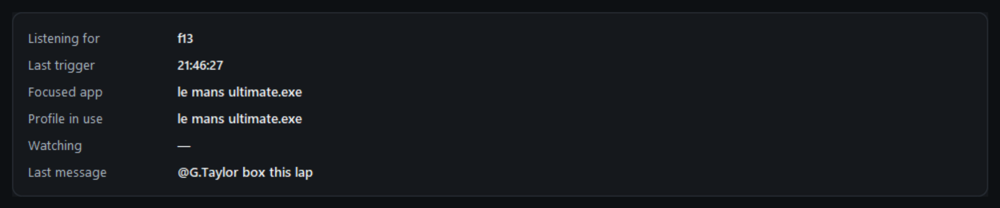

Everything you need to answer "why did nothing happen?" is here.

- **Listening for** — what the hook is armed with *right now*, read from the
  hook rather than from the config file. A key you saved but that never applied
  shows up here as the old one.
- **Last trigger** — stamped the moment the key is detected, before any audio
  or transcription work. If this updates and nothing else does, SimPitRadio saw
  your key and the problem is downstream. If it doesn't update, the key never
  reached it.
- **Focused app** — the executable name, which is the profile key. This is how
  you add a sim.

Below it, the live log:

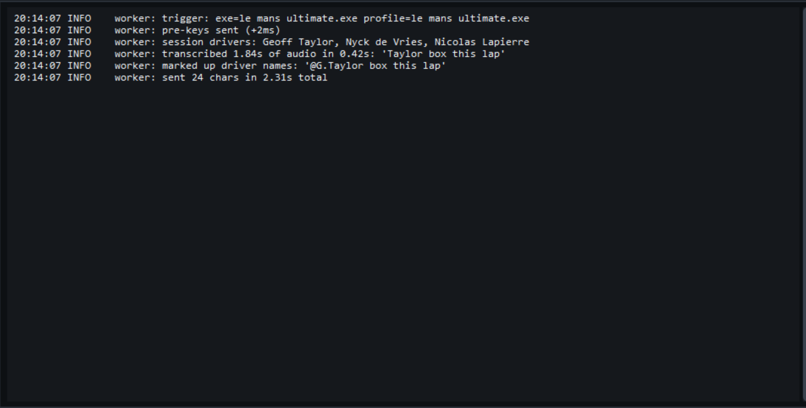

`pre-keys sent` means the chat box was asked to open. `transcribed` shows what
Whisper heard, before any mention matching. `sent N chars` closes the cycle.

### Settings → Trigger

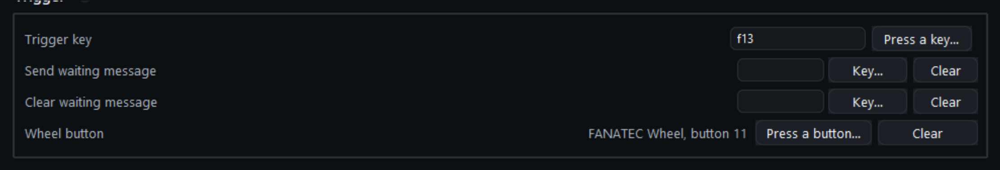

Three key bindings. All are optional except the trigger itself.

| Binding | What it does |
| --- | --- |
| **Trigger key** | hold to talk; swallowed, so it never reaches the game |
| **Send waiting message** | sends a message left in the chat box |
| **Clear waiting message** | discards it |

**Press a key…** binds whatever you press next, including `Ctrl+F12`, and
swallows it — so binding Enter doesn't also actuate whatever is behind the
window.

To use a wheel or gamepad button, map it to a key with JoyToKey first — see
[Binding a wheel or gamepad button](#binding-a-wheel-or-gamepad-button).

### Settings → Appearance

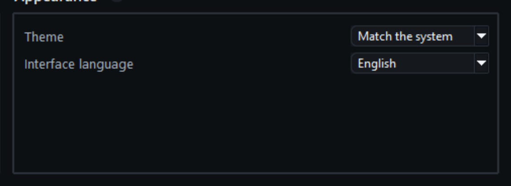

Light, dark, or follow the desktop. Applies on the next start.

### Profiles — one per sim

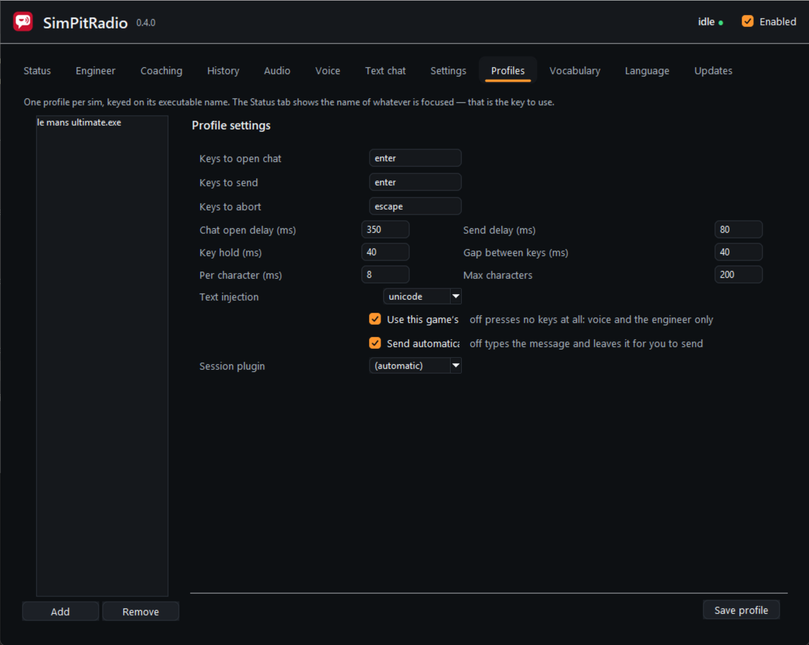

The setting that matters most is **Chat open delay**: the chat box needs a few
frames to open and take focus, and typing too early loses the opening
characters. Start at 350ms and raise it if messages arrive truncated.

**Send automatically** is off if you want to read a message before it goes out
— see [Checking a message before it goes out](#checking-a-message-before-it-goes-out).

**Session plugin** reads who is in the session so names transcribe correctly
and become mentions. Leave it on *automatic* unless you have a reason.

### Language

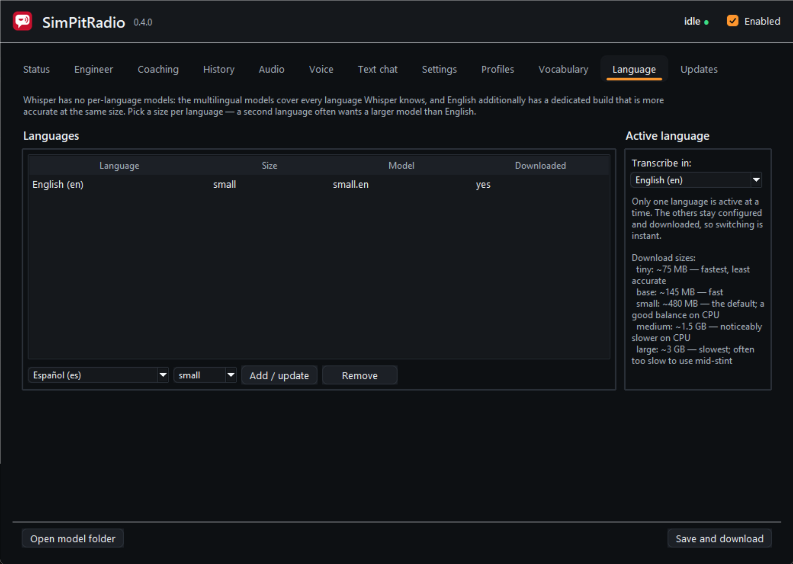

SimPitRadio picks your desktop's language the first time it runs. Whisper has no
per-language models — the `.en` builds are English-only and the rest are
multilingual — so choosing a language and a size here derives the model for
you. Changing it downloads the new model on save.

### Audio

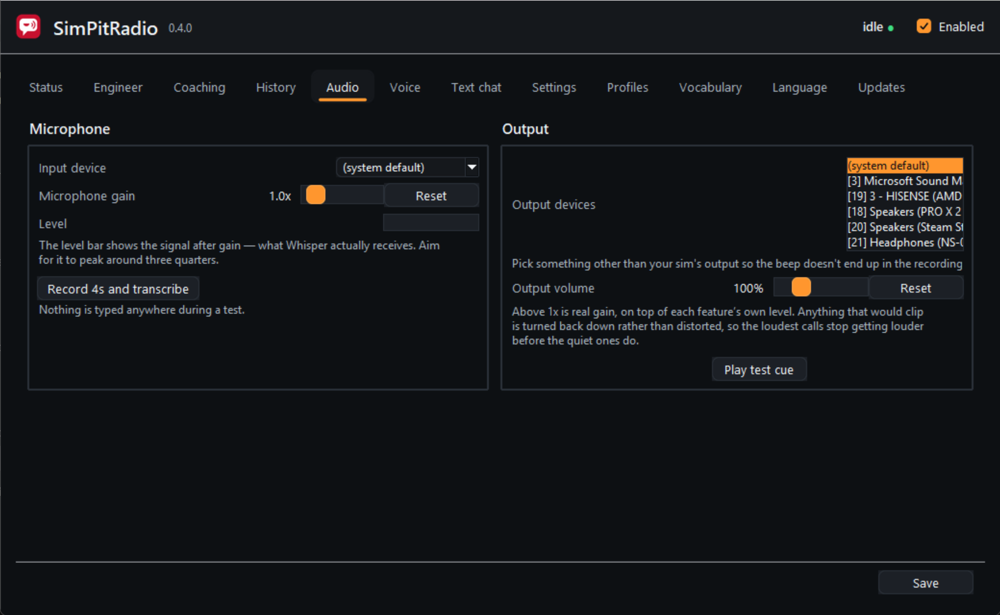

Pick the microphone, then **Record 4s and transcribe**. Nothing is typed
anywhere; it only proves the mic and the model work. If the level bar barely
moves while you speak, raise **Microphone gain** — the bar shows the signal
*after* gain, which is what Whisper actually receives.

### Engineer

A named voice that talks back: your lap times, cars alongside, flags, fuel,
damage, and the answer when you ask it something. Two recorded voices ship with
it — Norman and Claudia — and it falls back to a Windows voice for anything a
recording cannot cover, such as a driver's name.

Ask it to target somebody and it tells you, corner by corner, how your lap
compared:

> Chief, target P3
>
> *Targeting N.Tandy. Best lap, one twenty five point two seven.*
>
> *Turn one, N.Tandy was faster on the exit, six tenths.*

It uses the same push-to-talk button as everything else. **Engineer → Enable**
turns it on, and **Behaviours** on the same tab chooses which of its calls it
makes — lap times, the spotter, flags, damage — each with its own repeat
interval.

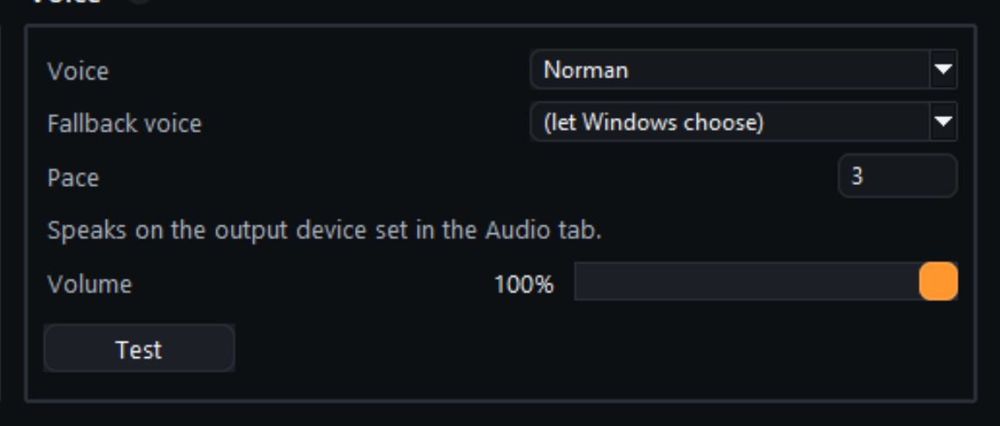

How it sounds is set in **Settings → Voice**. The coach can share that voice or
have its own — out of the box they are two people, Norman engineering and
Claudia coaching, so you can tell which of them is talking to you without
listening to the words.

**[docs/engineer.md](docs/engineer.md)** is the full guide: everything it says,
what each sim can answer, other languages, and installing a recorded voice
pack.

### Coaching

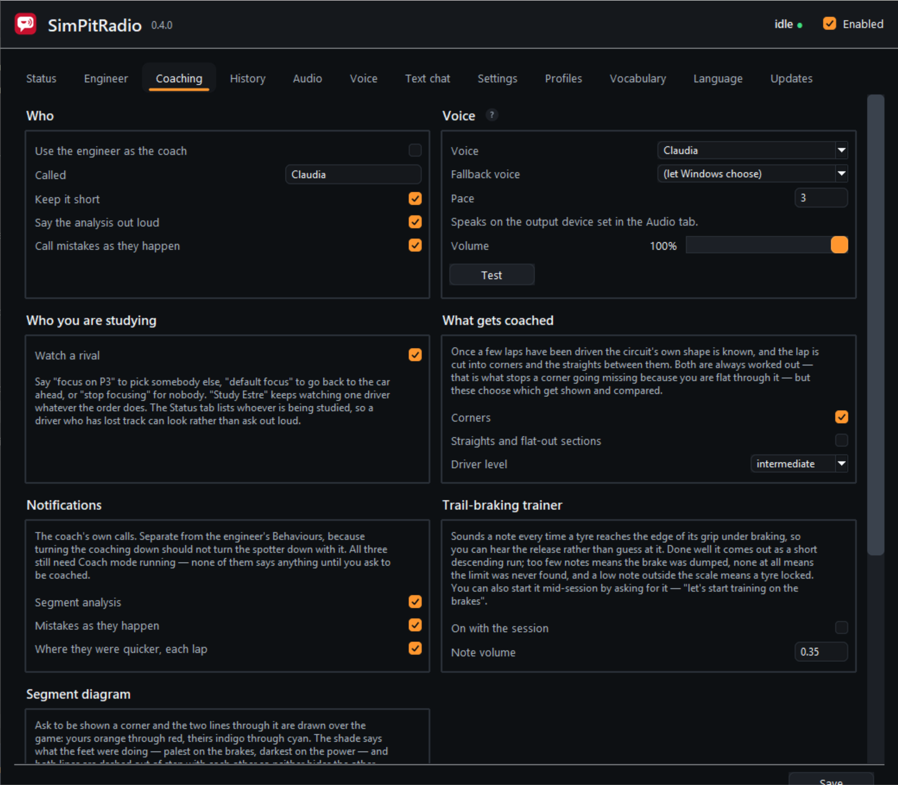

Pick somebody to study and, every time you finish a segment of the circuit, the
panel draws your line against theirs and the coach tells you what to do
differently.

> *Tosa, you gave up mid-corner speed because you were still on the brake at
> the apex, and they apex later so their exit straightens out sooner.*

It reads your pedals, your wheel and your gear, not just the clock — so what it
says is a cause rather than a restatement. Lock a wheel or put a wheel off and
it says so immediately, while you can still feel what you did.

#### Turning it on

Coaching is a voice command, not a tick-box: you ask for it when you want it
and it stands down when you say so. Hold push-to-talk and say any of these —
they are all two words or more, so the coach's name is optional.

| To do this | Say |
| --- | --- |
| Start coaching | **coach me** · *lead me to it* · *show me the lines* · *start coaching* |
| Stop | **stop coaching** · *stop the coaching* · *no more lines* |
| Choose who to measure against | **study Estre** · *focus on P3* · *keep an eye on the LMP2 leader* |
| Measure against your own best | **focus on me** · *study my best* · *focus on my ideal lap* |
| Go back to picking automatically | **default focus** · *automatic focus* |
| Hear what is running | **what coaching is on** |
| Redraw the corner you just did | **last corner** · *that corner* |

**You do not have to choose a rival.** Ask it to focus on *you* and the second
line becomes your own ideal lap — not a lap you have driven, but the best you
have managed through each corner, assembled. An empty practice session still
has somebody to race, and it is the honest opponent when there is nobody else
on track.

Every call is announced in the coach's voice rather than the engineer's, so
you can always tell which of the two is talking to you.

#### The trail-braking trainer

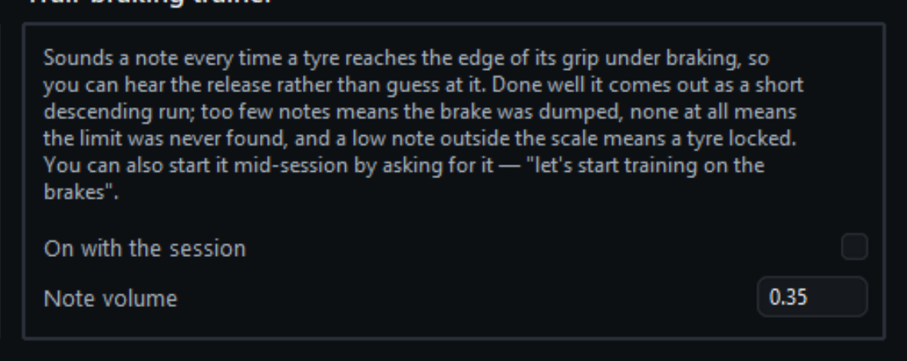

A piano note each time a tyre reaches the edge of grip under braking, so the
release becomes something you can hear rather than something you infer from a
lap time. Three to six notes down a braking zone is a clean release; one note
and silence means you came off it too fast.

| To do this | Say |
| --- | --- |
| Start | **train on the brakes** · *let's start training on the brakes* · *brake training* |
| Stop | **end brake training** · *stop training on the brakes* |

It learns your car's rolling radius over the first few braking zones, so it
works in any class and with the bias anywhere you like. **Coaching →
Trail-braking trainer** sets whether it arms with the session and how loud the
notes are.

#### What gets coached

**The circuit is worked out from your own laps.** After a few laps SimPitRadio
knows the shape of the road and cuts it into segments, so it works on any track
in any sim, including ones nobody has ever catalogued. Where there is a
catalogue you get names — "Tosa" rather than "turn seven".

A segment is a corner plus the run into it and the run out, because that is
what you drive:

- The **run-up** goes back to where you got on the brakes, capped at 250m. It
  is not a fixed length — brake later and the segment starts later.
- The **run-out** is 50m past the exit, enough to show where the car came out
  and where it was pointed.
- **Two corners you brake once for are one segment.** Club and Vale is one
  thing to drive and one thing to look at; so is Sebring's hairpin pair.
- **Bends you take flat are skipped**, because there is no braking point to
  move and no entry speed to carry. They are still on the map and still named
  — they are just not put in front of you. Turn on **Straights and flat-out
  sections** to see them anyway.

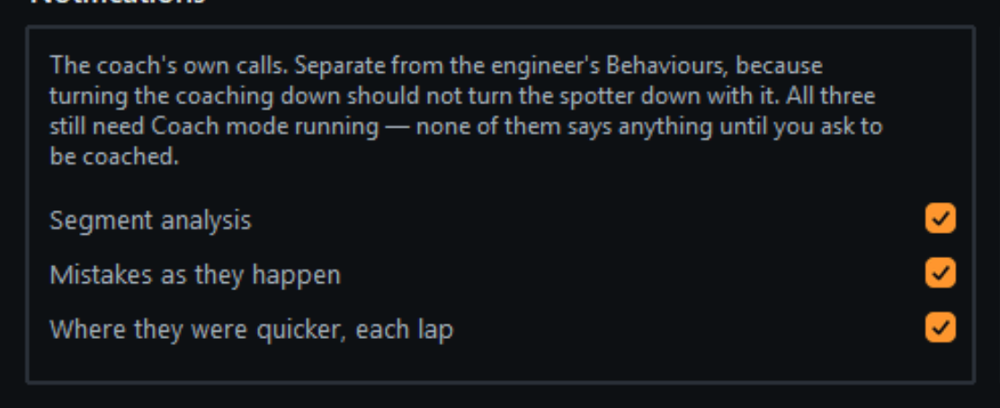

**Coaching → Notifications** turns the coach's three kinds of call on and off
independently: the **segment analysis** after each corner, **mistakes as they
happen** (a locked wheel, a trip off the road), and **where they were quicker**
once a lap. These are separate from the engineer's Behaviours, so turning the
coaching down does not turn the spotter down with it.

#### The diagram

The panel is a queue of three: one arriving, one being talked about in the
middle, one on its way out. Position is progress, so a glance tells you where
the coach is up to. The cards float over the game — there is no panel behind
them, only the diagrams themselves.

Your line is drawn in **orange through red**, a rival's in **indigo through
cyan**, and the shade says what your feet were doing: the hot end of each ramp
is braking, the middle coasting, the light end on the power. The road is a dark
ribbon between two white lines, drawn from the sim's own track-edge reading, so
a wheel put outside the line is drawn outside the line.

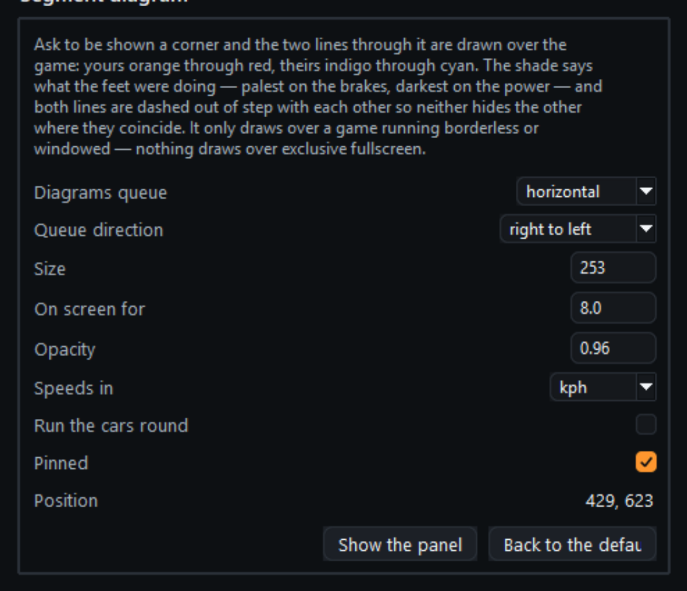

**Coaching → Segment diagram** places it, sizes it, and sets which way it
runs. **Show the panel** puts three sample corners up so you can drag it where
you want it and size it against the real thing.

### History

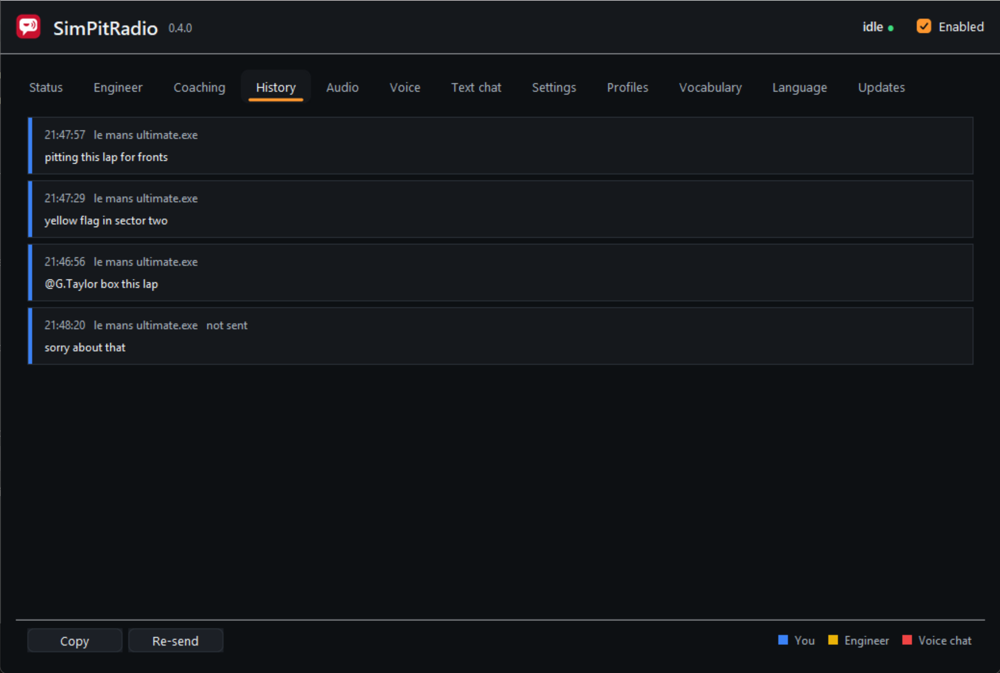

Every message, with what was heard and what was typed. **Re-send** retypes one
after a three-second countdown, which is there so you can focus the game first
— without it the message goes into SimPitRadio's own window.

### Voice chat

Hold the same key and the other SimPitRadio users in your session hear you. It is
off until you switch it on.

Distance is decided on **your** machine from the sim's own data — nothing about
where you are is ever sent — so a driver a straight away is quieter than one
alongside. See **[docs/voice-chat.md](docs/voice-chat.md)**.

---

## Adding your sim

Profiles are keyed on the game's executable name, and SimPitRadio tells you what
that is:

1. With the sim focused, tap the trigger key once.
2. Alt-tab to SimPitRadio. The **Status** tab shows **Focused app** — that's the
   executable name.
3. Go to **Profiles → Add**, and it will offer that name.
4. Set the keys your sim uses for chat. For most sims that's Enter to open and
   Enter to send.

Then tune it. The setting that matters is **Delay after opening chat**
(`pre_delay_ms`): the chat box needs a few frames to open and take focus, and
if SimPitRadio starts typing too early the opening characters vanish. Start at
350ms; raise it if you lose the beginning of messages.

Config changes take effect on the next trigger — no restart. The file lives at
`%APPDATA%\pitradio\config.json` if you'd rather edit it directly; the GUI and
a text editor write the same file.

**Got a sim working?** A profile that works is genuinely useful to other people
— please open an issue with the executable name and the keys.

---

## Nothing is typed into the game

Work down this list; it's ordered by how often each one is the answer.

1. **Is SimPitRadio running as administrator?** See above. This is most of them.
2. **Is the game in borderless windowed mode?** Exclusive fullscreen swallows
   synthetic input in some titles. Borderless is worth trying before anything
   else here.
3. **Does the chat box open at all?** Check the log (Status → Open log folder).
   If you see `pre-keys sent` but no text appears, the keys are reaching the
   game and the problem is the typing. If the chat box never opens, the
   `pre_keys` are wrong for that sim.
4. **Are the first characters missing?** Raise `pre_delay_ms`.
5. **Does the chat box open but stay empty?** The game is ignoring Unicode
   input. Set that profile's **Text injection** to `scancode`, which types
   character by character using real key presses instead. Slower, and limited
   to what your keyboard layout can produce, but some games accept nothing else.
6. **Still nothing?** A few games read input below the level `SendInput` can
   reach — usually anti-cheat related. The
   [Interception driver](https://github.com/oblitum/Interception) is the only
   real workaround, and it's a kernel driver, so treat it as a last resort.
   SimPitRadio doesn't use it.

The log records the executable name and per-stage timings for every trigger —
when the chat box opened, how long transcription took, when the message was
sent. That turns "it felt wrong" into something you can actually read.

---

## Session plugins

A plugin reads live data from a sim. Today that means the driver list, which
SimPitRadio uses two ways: it feeds the names to Whisper so they're transcribed
correctly, and it can prefix them in the message — say "tell Tandy to box" and
send `tell @Tandy to box`.

**Le Mans Ultimate ships with one**, reading LMU's shared memory with no
game-side plugin required. Assign it in **Profiles → Session plugin**; the
bundled LMU profile already has it. The choice lives on the profile, so a plugin
that suits two games can be assigned to both.

However you say the name, the mention comes out in the form sims put on screen:

| You say | It sends |
| --- | --- |
| "Geoff Taylor is quick" | `@G.Taylor is quick` |
| "tell Taylor to box" | `tell @G.Taylor to box` |
| "Geoff is quick" | `@G.Taylor is quick` |
| "de Vries is catching" | `@N.de Vries is catching` |

That's the point of replacing rather than just prefixing — `@G.Taylor` is what
every other driver sees on their own HUD, so they know immediately who's meant.

You can also refer to someone by their **standings position**, which is often
easier than a name you can't pronounce or didn't catch:

| You say | It sends |
| --- | --- |
| "tell P3 to move over" | `tell @N.de Vries to move over` |
| "P1 is pulling away" | `@M.Verstappen is pulling away` |
| "third place is quick" | `@N.de Vries is quick` |

A position nobody is in — "P40" in a twenty-car race — is left as you said it.
Turn this off under **Profiles → Le Mans Ultimate options**.

First names that double as racing speech are never matched on their own:
"max attack", "nick the inside line" and "will do" stay as they are. They're
still recognised inside a full name. Turn first-name matching off entirely with
`mentions.match_first_names`.

Note on the `@`: it's plain text. Neither LMU nor rFactor 2 chat supports
markup, so there's no bold and the game attaches no meaning to it — it's a human
convention, like writing someone's name in caps.

The accuracy half is the more valuable one. Whisper mangles proper nouns it has
no reason to expect; telling it who's in the session beats any amount of
matching after the fact.

Plugins can expose their own options, which appear in the profile editor once
the plugin is assigned. They're stored per profile, so the same plugin can be
configured differently for two games.

Plugins are compiled into the app — there's no way to add one after
installing, and adding a sim means a new release. Say which sim and what it
publishes in [an issue](https://github.com/kidunot89/simpitradio/issues/new/choose).

---

## Accuracy

The **Vocabulary** tab feeds Whisper a list of words to expect. Below the
editable list it also shows the **runtime vocabulary** — terms plugins supply
for the current session, and the exact prompt Whisper receives once the two are
combined. If a name keeps coming out wrong, that panel tells you whether it was
ever offered in the first place.

 It ships with
corner names, series terms and radio phrases, and it measurably improves proper
nouns. Add your regular team mates' names, your series' jargon, tracks you run
often.

Transcription runs on the **CPU, deliberately** — the GPU belongs to the sim. A
model grabbing VRAM mid-corner costs frames, and a few hundred milliseconds of
CPU transcription doesn't.

### Other languages

The **Language** tab configures which languages you want and how large a model
to use for each. Add a language, pick a size, press **Save and download**, and
the models are fetched into the cache.

Worth understanding, because it shapes the choices: **Whisper has no
per-language models.** There are English-only builds (`tiny.en` … `medium.en`)
and multilingual builds (`tiny` … `large-v3`), and every multilingual build
handles all the languages. Picking a size per language is still useful —
multilingual `small` is weaker than `small.en`, so a second language often wants
a bigger model than English does. "Medium Spanish, small English" means `medium`
when transcribing Spanish and `small.en` when transcribing English.

Only one language is active at a time. The others stay configured and
downloaded, so switching is instant.

Sizes trade accuracy against latency, and latency is what you feel mid-stint:

| Size | Download | Notes |
| --- | --- | --- |
| tiny | ~75 MB | fastest, least accurate |
| base | ~145 MB | fast |
| small | ~480 MB | the default; a good balance on CPU |
| medium | ~1.5 GB | noticeably slower on CPU |
| large | ~3 GB | often too slow to use between corners |

Also replace the **Vocabulary** text when you change language: it ships as
English racing terms, and a prompt in the wrong language works against you.

---

## Updates

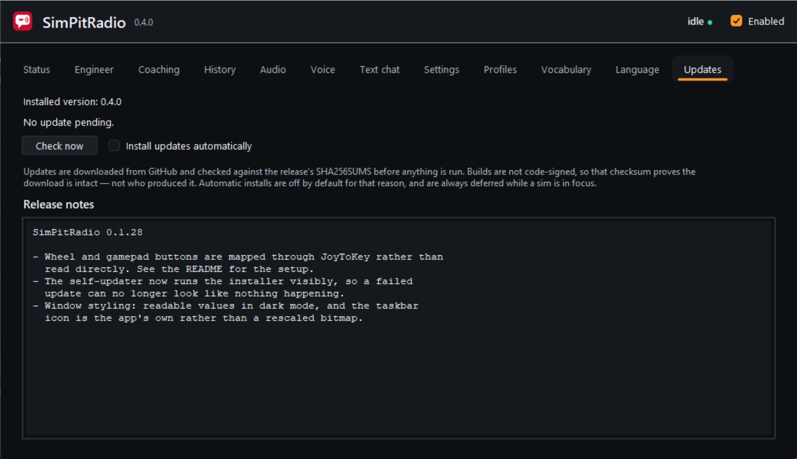

SimPitRadio checks GitHub for new releases and can install them itself. Automatic
installs are **off by default**, and always deferred while a sim is in focus —
restarting the app mid-stint would be worse than updating a day later.

**What the verification does and doesn't prove.** Downloads are checked against
the `SHA256SUMS` published with the release before anything is run. That proves
the download arrived intact. It does not prove who produced it — the builds
aren't signed, so if the repository or a release were compromised, the updater
would install whatever was there, with administrator rights. That is why
auto-install is opt-in. Code signing would fix this properly and is the obvious
next step for the project.

Updating closes SimPitRadio, installs, and reopens it. Your config, logs and the
cached speech model live outside the install directory, so none of them are
touched — an update never re-downloads the model.

Turn the check off entirely with `--no-update-check`, or in
`config.json` under `updates`.

---

## Privacy

- Speech recognition runs entirely on your machine. Audio is never uploaded and
  never written to disk.
- The app makes exactly two kinds of network request: downloading the speech
  model on first run, and checking GitHub for updates.
- Transcription history is kept in memory only, and goes away when you quit.
- The keyboard hook only acts on the configured trigger key. Every other key is
  passed straight through untouched.

---

## Reporting a fault

[Open an issue](https://github.com/kidunot89/simpitradio/issues/new/choose), and say
what the Status tab shows. Almost everything in this app fails silently, so the
log is usually the only thing that says why.

Two contributions are worth more than any bug report, and neither needs code:

- **A profile for a sim.** The Status tab shows the executable name; that plus
  your sim's chat keys is a complete contribution.
- **A translation.** Every string in the interface is one entry in one JSON
  file, and a partial translation is fine.

---

## Licence

SimPitRadio is made by **AxisTaylor, LLC** and is proprietary software. Installing or
using it means accepting the [end-user licence](LICENSE.md).

Releases up to and including **v0.3.0** were published under the MIT
licence and stay that way for anyone who has them — that grant cannot be
withdrawn and is not being withdrawn. Later releases are under the licence
above.

Copyright © 2026 AxisTaylor, LLC. All rights reserved.
