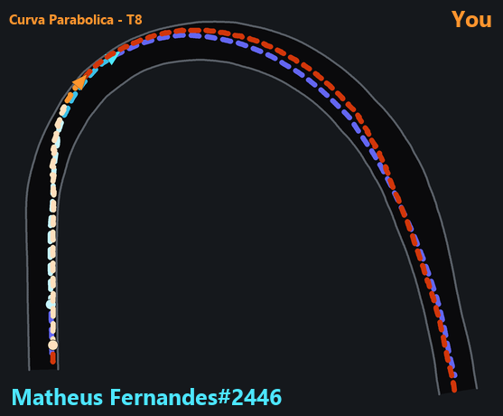
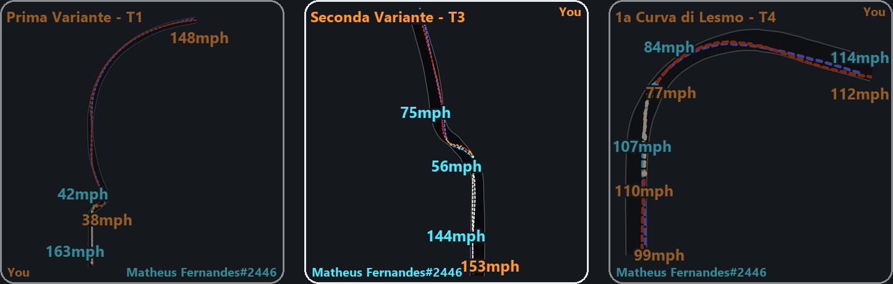
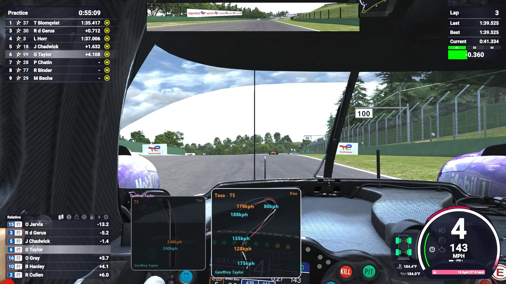
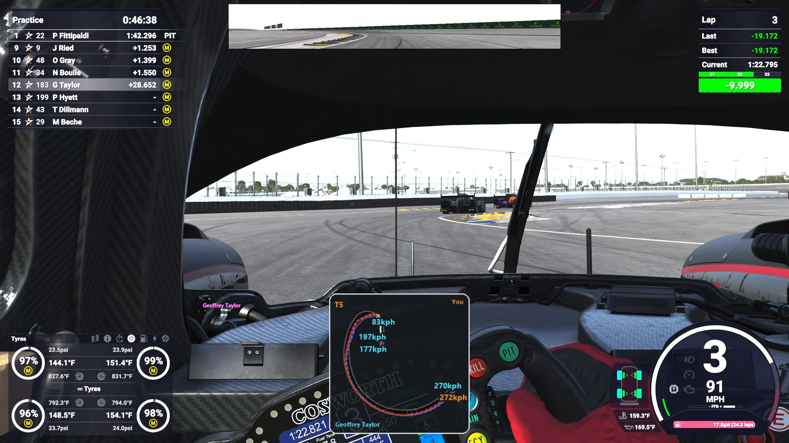

# The coach

Pick somebody to study. Every time you finish a segment of the circuit the
panel draws your line against theirs and the coach tells you what to do
differently.

> *Tosa, you gave up mid-corner speed because you were still on the brake at
> the apex, and they apex later so their exit straightens out sooner.*

It reads your pedals, your wheel and your gear as well as the clock, so what it
says is a cause and not a restatement of the timing screen. Lock a wheel or put
one off the road and it says so immediately, while you can still feel what you
did.

The coach is a second voice with settings of its own: its own volume, its own
notifications, and every call announced in that voice so you always know which
of the two is talking to you. **Coaching → Who** sets it up. Ticking *Use the
engineer as the coach* gives them one voice if you would rather.

## Quick start

1. Drive three or four laps. The coach works the circuit out first: see
   [Where the segments come from](#where-the-segments-come-from).
2. Hold the trigger and say **"coach me"**.
3. Say **"focus on P3"**, or **"focus on me"** to be measured against your own
   best.
4. Drive. After each corner the panel draws it and the coach talks.

Nothing here is a tick box you set before a session. Coaching is asked for out
loud when you want it and stands down when you say so, because whether you want
to be talked at through a corner is a decision you make lap by lap.

## Talking to it

Most of the phrases below run to two words or more, so the coach's name is
optional in front of them. The exceptions are "study" and "watch": both are
single words, and everything said after one is the driver's name, so both need
the coach's name in front. *Chief, study Estre.*

| To do this | Say |
| --- | --- |
| Start coaching | **coach me** · *lead me to it* · *show me the lines* · *start coaching* |
| Stop | **stop coaching** · *stop the coaching* · *no more lines* |
| Choose who to measure against | **study Estre** · *focus on P3* · *keep an eye on the LMP2 leader* |
| Measure against your own best | **focus on me** · *study my best* · *focus on my ideal lap* |
| Go back to picking automatically | **default focus** · *automatic focus* |
| Hear what is running | **what coaching is on** |
| Redraw the corner you just did | **last corner** · *that corner* |

One word taking an argument with no end would otherwise swallow a message
meant for the session. "focus on" and "keep an eye on" are long enough to be
safe on their own, which is why they are there.

**You do not have to choose a rival.** Ask it to focus on *you* and the second
line becomes your ideal lap: your best through each corner, stitched together.
No lap you drove looks like it. An empty practice session still has somebody to
race, and on an empty track it is the honest opponent.

## Where the segments come from

**The circuit is worked out from the laps driven in the session**, yours and
everybody else's, rather than from a database. Every lap is pooled onto a grid
five metres apart, and the median of what came through each point is where the
road is. Four laps have to cross a point before it is trusted, and half the
circuit has to be known before a road is built at all.

So it works on any track in any sim, including ones nobody has ever
catalogued. Where a catalogue exists you get names, *Tosa* rather than *turn
seven*. Where one does not, you get numbers and everything else works exactly
the same.

The pooling is done twice. The first pass has no road to measure against, so it
uses the car's own heading to work out which way is across the track. A car
weaving is never pointing along the road, so the answer comes out wrong in the
same direction on every lap. Once there is a road, its own direction is the
right reference and the second pass corrects it. On a synthetic circle driven
with a three-metre weave, the first pass put the road two and a half metres
wide of where it actually was.

### What counts as a segment

A segment is a corner plus the run into it and the run out, because that is
what you drive.

- The **run-up** goes back to where you got on the brakes, capped at 250m.
  Brake later and the segment starts later.
- The **run-out** is 50m past the exit, enough to show where the car came out
  and where it was pointed.
- **Two corners you brake once for are one segment.** Club and Vale is one
  thing to drive and one thing to look at. So is Sebring's hairpin pair.
- **Bends you take flat are skipped.** A corner held above 90% throttle has no
  braking point to move and no entry speed to carry, so it is treated as a
  straight. It stays on the map and keeps its name, and it is simply never put
  in front of you. Turn on **Straights and flat-out sections** under *What gets
  coached* to see them anyway.

Merging and skipping both need a reference lap. Without one the coach has no
grounds to decide that two corners are really one, so it leaves them apart.

## What it says

**Coaching → What gets coached → Driver level** decides how much. All three
levels look at the same corner and find the same fault; they drop clauses
rather than findings.

| Level | What you get |
| --- | --- |
| **beginner** | All of it — what was better, what was worse, what caused it, and what to do |
| **intermediate** | No consequence. The fault and the fix, assuming you know what understeer at the apex does to an exit |
| **advanced** | No fix either. What was good and what was wrong; being told "brake earlier" is usually being told something you already know |

Some of what it measures, and the thresholds it uses, so you know when it is
staying quiet on purpose:

- Two speeds have to differ by half a metre per second, which is under 2 km/h,
  before it is worth mentioning. Below that the two of you did the same thing
  and the difference is where the laps happened to be sampled.
- Using the road means reaching 85% of its half-width, not all of it. A driver
  putting a wheel exactly on the white line every lap is a driver taking track
  limits, and the line that wins is the one that gets close.
- A pedal counts as pressed at 5% travel, and the wheel counts as turned at 5%
  of lock. Sim pedals and wheels rarely rest at exactly zero.

## Notifications

**Coaching → Notifications** turns the coach's three kinds of call on and off
independently:

- **Segment analysis**: the read-out after each corner.
- **Mistakes as they happen**: a locked wheel, a trip off the road, called
  immediately rather than saved up.
- **Where they were quicker**: once a lap.

These are separate from the engineer's Behaviours on purpose, so turning the
coaching down does not turn the spotter down with it. All three still need the
coach running, and none of them says anything until you have asked to be
coached.

## The diagram

Monza's Parabolica, drawn from a real session. The pale run is braking, the
dark run is on the power; the circle is where each car got on the brakes and
the triangle where it got back on the throttle, pointing the way round.

The panel holds three diagrams: one arriving, one being talked about in the
middle, and one on its way out. Position is progress, so a glance tells you
where the coach is up to. The diagrams float over the game with nothing behind
them.

Your line is drawn in **orange through red**, a rival's in **indigo through
cyan**. Hue says whose line it is. **Lightness says what the feet were doing**,
palest on the brakes and darkest on the power. Both lines are dashed and the
two patterns are offset by half a period, so where the cars take exactly the
same line each shows through the other's gaps instead of one hiding the other.
Each driver's name is written into whichever corner of the diagram is
emptiest, in that driver's own colour, so you never have to remember which ramp
is whose.

The road is a dark ribbon between two white lines, taken from the sim's own
track-edge reading rather than guessed from the racing line. A wheel put
outside the line is drawn outside the line.

Three diagrams: one arriving, the one being talked about in the middle, one on
its way out. The middle one is the corner the coach is speaking about.

### What it looks like from the seat

Imola, mid-session. Two diagrams are up at once, the corner just finished and
the one before it, and both name themselves from the circuit's catalogue
rather than by number. They sit over the game with nothing behind them, so the
only thing added to the screen is the drawing.

The same thing on a circuit nobody has catalogued. The corner is called `T5`
instead of being named and everything else works identically: the road from
the sim's own track-edge reading, both lines dashed and offset so neither
hides the other, and the speeds at entry, apex and exit.

**Coaching → Segment diagram** places it, sizes it, sets its opacity and
chooses which way the queue runs. **Show the panel** puts three sample corners
up so you can drag it where you want it and size it against the real thing.

It draws over a game running borderless or windowed. Nothing draws over
exclusive fullscreen, which is a property of the display mode rather than a
setting.

## The trail-braking trainer

A piano note each time a tyre reaches the edge of grip under braking, so the
release becomes something you can hear rather than something you infer from a
lap time afterwards.

Releasing the brake is the hardest thing in the car to learn by feel. The pedal
gives back almost nothing, the target moves as the car slows and as lock goes
on, and a driver can spend a season a long way under the limit without ever
finding out. It sounds one note per release step. A continuous tone tracking
slip would be a buzzer you learn to ignore, and it would report where you are
when what you need is a moment to act on.

| What you hear | What it means |
| --- | --- |
| Three to six notes, descending | A clean release |
| One note, then silence | You came off the brake too fast |
| No notes at all | The limit was never found |
| A low note outside the scale | A tyre locked |

| To do this | Say |
| --- | --- |
| Start | **train on the brakes** · *let's start training on the brakes* · *brake training* |
| Stop | **end brake training** · *stop training on the brakes* |

It learns your car's rolling radius over the first few braking zones, so it
works in any class and with the brake bias anywhere you like. **Coaching →
Trail-braking trainer** sets whether it arms with the session and how loud the
notes are. Its volume is separate from the coach's because the two are mixed
rather than queued. A note sounds over whatever is being said, and a note only
has to be noticed where speech has to be understood.

## Nothing is drawn

**Give it a few laps.** Under four laps through a stretch of circuit there is
no road there, and with less than half the circuit known there is no road at
all. This is the usual answer.

**Check the sim publishes a position.** The lines are drawn from X/Z
coordinates and the track edge. A sim that does not publish them still gives
you lap times, mistakes and the spoken analysis. It cannot give you a picture.
See [What each sim can do](engineer.md#what-each-sim-can-do).

**Check it is not exclusive fullscreen.** Borderless or windowed only.

**Check you actually asked.** Coaching is off until you say so. When it starts
it says "coaching" back, then who it is measuring you against and either how
many segments it has or "learning the track".
